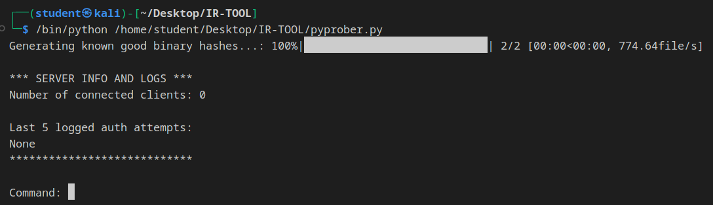
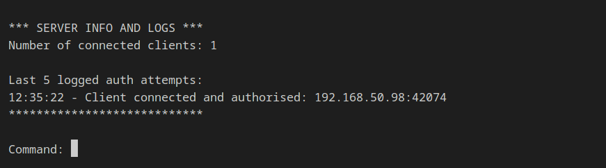
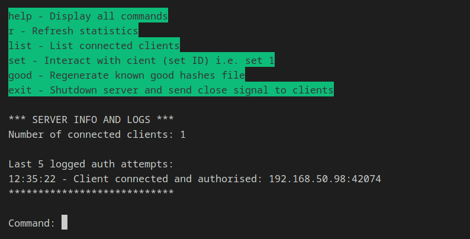
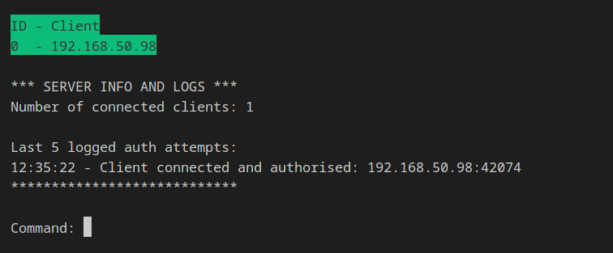
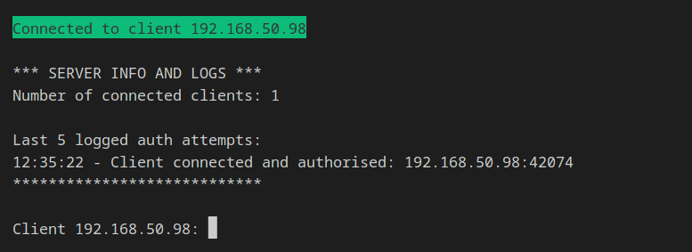
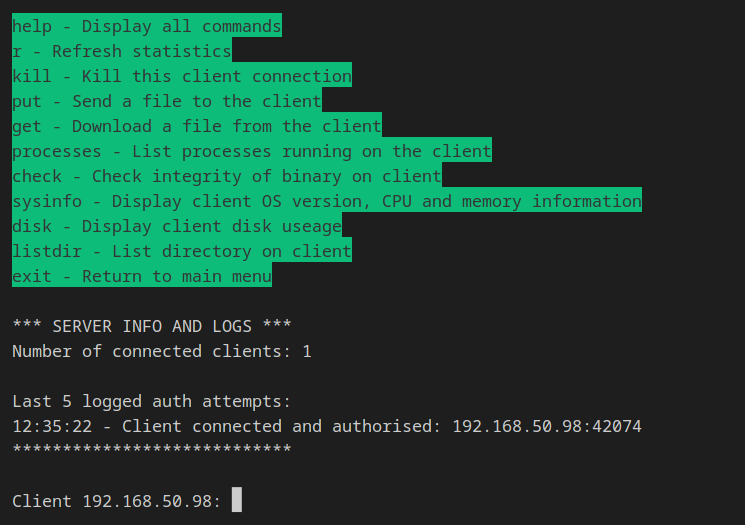
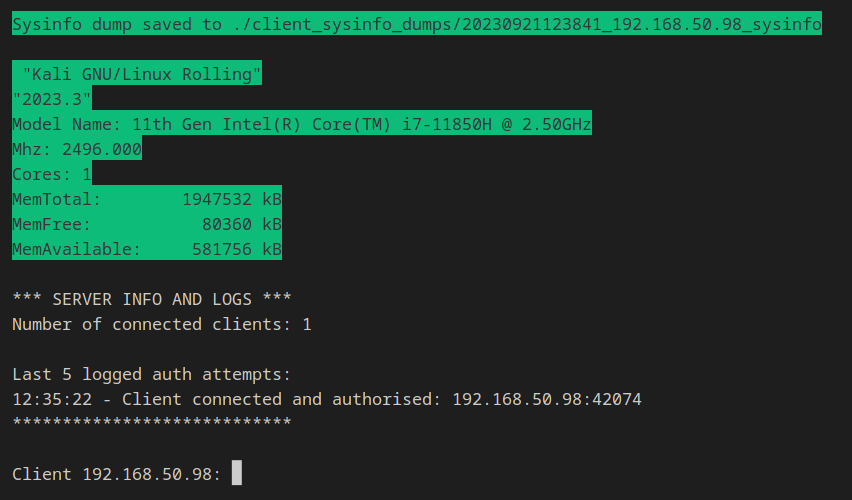

# Hobby Project

# PyProber - A simple multi-threaded tool to request information from clients

## Features:
- Multi-threaded server (accept multiple clients)
- Encrypted communications with TLS
- Easy to use CLI with minimal input
- Create a list of known good hashes from the server binaries
- Authorise clients via IP address
- Saves all information dumps from clients to files for detailled interrogation

### Functionality:

#### OS Functionality:

- Put a file from the server onto the client
- Get a text or log file from the client
- Retrieve a dump of client processes and save to file (partially implemented, requires client side additions)
- Retrieve CPU usage statistics from the clients and save to file
- Retrieve OS version information from clients and save to file
- Retrieve memory useage from clients and save to file
- Store outputs from sysinfo commands to compare against future retrievals
- Display client disk useage and save to file
- List a directory on the client

#### Network Functionality

- Continually check client connections are alive to maintain connection integrity
- EOM delimiter is sent with every message

### To be added:

#### OS Functionality

- ~~Put a file from the server to a client~~
- ~~Get a text or log file from the client~~
- ~~List what processes are running on the client~~
- List what services are running on the client
- Retrieve list of hashed system binaries from the client and check against known good hashes to identify suspicious changes (implemented on server only currently)
- ~~Retrieve CPU usage statistics from the client~~
- ~~Retrieve OS version information from client~~
- ~~Retrieve memory useage from client~~
- ~~List a directory on the client~~
- ~~Display client disk useage~~
- Start or restart processes on the client
- ~~Store outputs from sysinfo commands to compare against future retrievals~~

#### Network Functionality

- Investigate the network state of the client to identify processes with suspicious network connections
- Sniff network traffic on the client
- Username and password client authorisation

#### Code fixes required:
- Remove log_controller and implement in main, original plan for decorators is not needed
- Remove large elif statements

## Installation and start:

##### 1. Download and navigate to folder
```bash
git clone https://github.com/alex938/Home_Server_Control_Framework.git
cd Home_Server_Control_Framework
```

##### 2. Ensure considerations have been met

##### 3. Start server
```bash
python3 pyprober.py
```

##### 4. Connect clients
```bash
python3 client.py
```

##### 5. Most commands save outputs dumps to their relevant folders

## Considerations (IMPORTANT!):

- Ensure you have entered your desired server IP into the config.toml file
- Ensure you have all IR tools you want to upload to clients in the 'tool_box' folder (this folder will be created on first run if it does not exist, please place tools in here at anytime)
- Ensure you have set the paths for directories for hash checking in file_manager.py, default is /usr/bin
- Ensure all client IP addresses you are expecting to connect to the server are listed in authorised_ips.txt

## Useage examples:

##### Server Menu:



##### Client Connect


##### Server Menu Clients Connected:



##### Server Menu 'help'



##### Server Menu 'list' Clients



##### Server Menu 'set' Session



##### Server Client Control Menu 'help'



##### Server Client Control Menu 'sysinfo'



##### Server Client Control Menu 'get' File


##### Server Client Control Menu 'put' File Selection


##### Server Client Control Menu 'put' File Send

